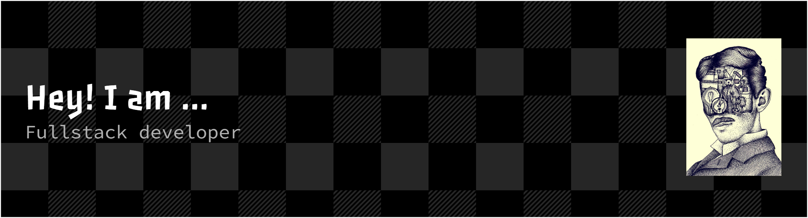

# Hi there, I'm [Mark Maina]! 👋

I am a passionate software engineer dedicated to solving real-world problems. I aim to leverage technology and innovation to create impactful solutions that reduce unemployment worldwide while empowering people with opportunities for growth and success.
https://www.codewars.com/users/Elonmusk254

- 🌱 Currently learning: **[Introduction to CLI at AlX]**
- 🔭 Working on: **[CLI Commands like mkdir, cd, pwd, cp, mv,rm touch,]**
- 🌍 Languages: **[programming languages *JavaScript | Python | Dart | HTML | CSS | SQL* and human languages i speak English and kiswahili]**
- 📫 How to reach me: **[markmaina500@gmail.com,]**
- ⚡ Fun fact: **[I love cats]**

## My Skills 🧠

*Replace the above skill badges with your own skills and expertise. To create more badges, use [checkout this repo](https://github.com/alexandresanlim/Badges4-README.md-Profile).*

## Featured Projects 💻

## Get in Touch 📬

- **[Personal Website / Blog]**(your_website_or_blog_link)
- **[LinkedIn]**(www.linkedin.com/in/mark-sertified-10b544146)
- **[Twitter]**(your_twitter_profile_link)

